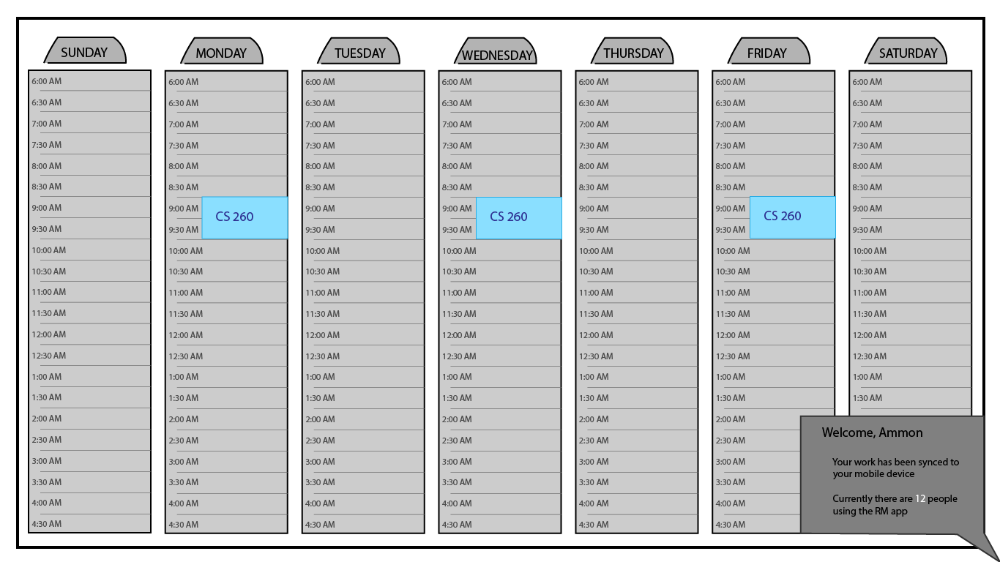

## The RM: a planner

### Deliverable so far:
- HTML Structure
  - Tags, links, some text
  - Placeholders for API, database, and websocket
- CSS Formatting
  - Navigation, buttons, fonts, etc.
  - Responsive design
- Javascript Implementation
  - Javacript handling of event handling in planner
  - Real-time saving and loading of events (placeholder for WebSocket)
  - Events saved to local storage (placeholder for database)
  - Login handled in javascript (placeholder for authentication)
- Service Endpoints
  - Startup is now a web service using Node.js and Express
  - Endpoints used to serve up html files (Middleware)
  - Endpoints used to save and load events to the server
    - This will soon be locked behind authentication, but for now everyone in the world saves and loads the same set of events.
  - Quote API called in the planner page
    - Also, Google Maps API accessed under Maps page
- Database/Login
  - Handles account creation and login
  - Stores users and their passwords securely
  - Can't use the planner unless authenticated
  - The events on your planner are saved with your account (Try making a few accounts to try it out)
- Websocket
  - Websocket is used to maintain a list of Live Users
  - Users (Frontend) send a message with their username upon connection
  - Users (Frontend) process messages they receive to display the list of live users
  - Server (Backend) receives user's info when they connect and updates the list of live users
  - Server (Backend) sends that list to all users, who then update their lists

### Elevator Pitch
An estimated 65 percent[^1] of students attending BYU are returned missionaries, and every single one of us has been trained to live off the planner, dream of the planner, and die for the planner. This AreaBook Planner (now called Preach My Gospel: the app[^2]) is an application that missionaries use to detail their days, plan their time, and track their results. Returned missionaries are left stranded without access to that planner app anymore, until now.

[^1]: https://magazine.byu.edu/article/answering-the-call/
[^2]: https://play.google.com/store/apps/details?id=org.churchofjesuschrist.areabook
### Design:

### Key Features
- Secure login over HTTPS
- Ability to create events in your week and year
- Customization of event name and color
- Your schedule is persistently stored with your account
- Accesible from PC and mobile phone
### Possible Expansions
Depending on time and complexity of implementation, the website may also end up including:
- Notifications to the browser as events arrive
- Fill out if an event happened or not
- Customized repeating events
- Smooth mobile experience

### Technologies
I am going to use the required technologies in the following ways.

- **HTML** - The application uses standard HTML structure in two HTML pages: One for the login, and one for planning.
- **CSS** - The application will have good looking formatting and responsive design, along with good whitespace, color choice and contrast.
- **JavaScript** - Login process, event creation, customization, and display, backend endpoint calls.
- **Service** - A backend service with endpoints for:
    - login
    - retrieving schedule
    - creating events
    - retrieving changes to events
    - retrieving number of current users
- **DB/Login** - Store users and their schedules in a database. User information is stored securely, and used for registration and Login. Each schedule is associated with its user.
- **WebSocket** - As a schedule is changed it is updated on the server, allowing for simultaneous use between PC and mobile devices on the same schedule. Also, display of number of current users.
- **React** - Application ported to use the React web framework.